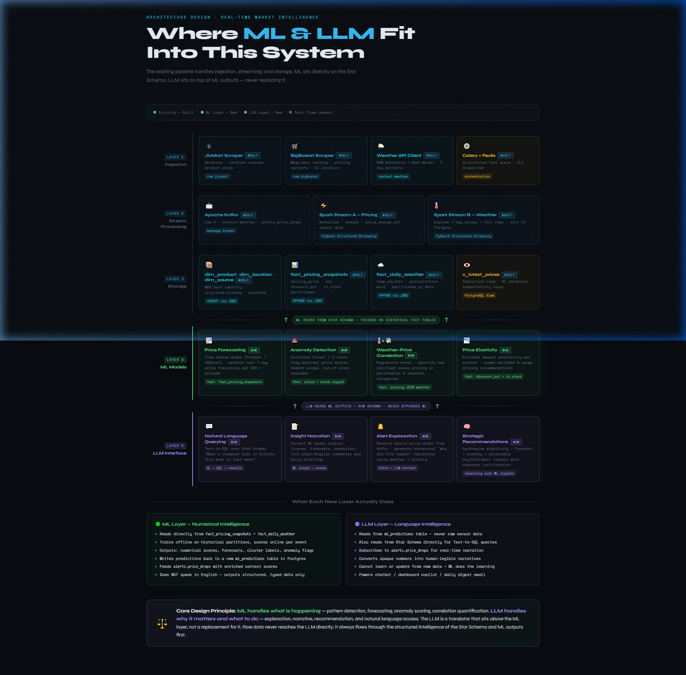

# Marketintel — Real-Time Market Intelligence Pipeline

A high-performance data pipeline for scraping, processing, and analyzing commodity pricing from JioMart and BigBasket in real-time, enriched with localized weather context.

## 🏗️ Architecture Stack

### Layer 1: Ingestion
- **JioMart Scraper**: Selenium-based extraction with location-aware cookies.
- **BigBasket Scraper**: Category-driven catalog crawler using Selenium and variant detection.
- **Weather API Client**: Localized weather data via Open-Meteo (OpenStreetMap Nominatim for geocoding).
- **Orchestration**: Celery + Redis for distributed task scheduling and fault tolerance.

### Layer 2: Stream Processing
- **Apache Kafka**: Multi-topic message broker (`raw.*`, `context.weather`, `alerts.*`).
- **PySpark Structured Streaming**:
  - **Pricing Engine**: Normalization, deduplication, and real-time price change detection.
  - **Weather Engine**: Temporal expansion and localized mapping to product snapshots.

### Layer 3: Storage (Star Schema)
- **PostgreSQL**: Analytical database using a Star Schema.
  - **Dimensions**: `dim_product`, `dim_location`, `dim_source`.
  - **Facts**: `fact_pricing_snapshots` (partitioned), `fact_daily_weather`.
  - **Views**: `v_latest_prices` for BI and downstream consumption.

### Layer 4 & 5: ML & LLM (Future Scope)
- **ML Layer**: Numerical intelligence for forecasting, anomaly detection, and weather correlations.
- **LLM Layer**: Language intelligence for natural language querying (Text-to-SQL) and automated insight narration.

## 🚀 Getting Started

### Prerequisites
- Python 3.10+
- PostgreSQL 14+
- Apache Kafka & Zookeeper
- Apache Spark 3.x
- Redis

### Setup
1. Clone the repository
2. Create a virtual environment: `python -m venv venv`
3. Install dependencies: `pip install -r requirements.txt`
4. Configure environment variables in `.env`
5. Bootstrap the database: `python bootstrap_db.py`
6. Start the scrapers: `celery -A market_intelligence worker --loglevel=info`

## ⚖️ Design Principle
**ML handles what is happening** (patterns, forecasts, anomalies).  
**LLM handles why it matters** (explanations, narratives, recommendations).
