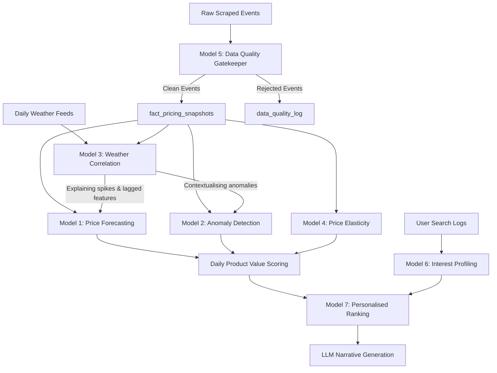

# Intelligence & ML Layer: Architecture Deep Dive

This document outlines the detailed algorithmic architecture, execution schedules, and data flows for the 7 primary intelligence models powering the Market Intelligence platform.

---

## 1. System Dependency Graph

Understanding the dependency chain is critical for operation. If an upstream model fails, downstream systems must gracefully degrade to their last known valid state.

---

## 2. Models Overview & Scheduling

### Model 1: Price Forecasting (The Directional Signal)
* **Goal**: Predict price movement over the next 7 days to determine whether a user should buy now or wait.
* **Algorithms**:
  * **Prophet (Vegetables/Volatile goods)**: Captures weekly procurement cycles and specific festival effects (e.g., Durga Puja spikes).
  * **LightGBM (Packaged goods)**: Handles step-function price adjustments inherent to MRP revisions better than smooth linear trends.
* **Frequency**: Nightly/Weekly batch retraining.
* **Outputs**: `predicted_price_d1` through `d7`, Confidence Intervals, and a rolled-up scalar `forecast_trend` written to `ml_predictions`.

### Model 2: Anomaly Detection (The Early Warning System)
* **Goal**: Identify unexpected price shocks that diverge from stable historical patterns.
* **Algorithms**: 
  * **Isolation Forest**: (Point anomalies) Scores individual events against a context-rich feature space.
  * **CUSUM (Cumulative Sum)**: (Trend anomalies) Sequentially detects slow directional drift based on a `rolling_30_mean` target and half-sigma slacks.
* **Frequency**: Streaming inference (Real-time). Batch retraining (Weekly).
* **Outputs**: `point_anomaly_score`, `trend_anomaly_direction`, `anomaly_type`, and SHAP-based feature attributions written to `ml_predictions` and `alerts.price_drops` Kafka topics.

### Model 3: Weather–Price Correlation (The "Why")
* **Goal**: Quantify the lagged causal effect of extreme weather on retail supply chains for LLM context generation.
* **Algorithm**: **Lagged Cross-Correlation (Pearson)** on STL-deseasonalised price residuals, testing lags 0 through 3 days.
* **Frequency**: Monthly batch.
* **Outputs**: `correlation_r`, `optimal_lag_days`, and categorical descriptors (e.g., "strong", "moderate") written to `weather_correlation_coefficients`.

### Model 4: Price Elasticity Estimation (The Urgency Multiplier)
* **Goal**: Rank products by demand sensitivity to determine if a discount will trigger an immediate stockout.
* **Algorithm**: **OLS Regression on Proxy Metrics** (discount events followed by 3-day stockouts) merged with Bayesian priors derived from economic food category literature.
* **Frequency**: Monthly batch.
* **Outputs**: Normalized `elasticity_index` (from 0 to -3.0) and descriptive `elasticity_confidence` written to `ml_predictions`.

### Model 5: Data Quality Detection (The Gatekeeper)
* **Goal**: Prevent scraper timeouts, structural HTML changes, and cached-page artifacts from poisoning the ML context.
* **Algorithms**: Mixed hierarchy.
  * **Hard Rules (Rejection)**: Negative prices, selling > MRP * 1.5, excessive overnight % swings for stable categories.
  * **Statistical Flags (Downweighting)**: 4-sigma deviations, cross-source divergence (>40%), stale price cache detection (21 identical days for vegetables).
* **Frequency**: Streaming (Inline Spark UDF).
* **Outputs**: Appends `data_quality_flag` ("clean", "flagged", "rejected") to the pipeline. Routes failures to `data_quality_log`.

### Model 6: User Interest Profiling (The Personalisation Anchor)
* **Goal**: Translate historical prompt/search behavior into an up-to-date category preference weighting.
* **Algorithm**: **Decaying Weighted Frequency**. Applies an exponential temporal decay (7-day half-life) combined with hardcoded Intent Multipliers (e.g., actual buy signals carry 1.5x weight over casual queries).
* **Frequency**: Nightly Batch (e.g., 08:15 AM).
* **Outputs**: Normalized `category_weights`, `top_products`, and `profile_confidence` written to `user_profiles`.

### Model 7: Personalised Value Ranking (The Synthesis Engine)
* **Goal**: Rank the 10 most relevant and valuable products tailored to a specific user on a specific day.
* **Algorithm**: **Deterministic Weighted Scoring**. 
  * Category Relevance (40%) + Market Value Score (35%) + Forecast Urgency (15%) + Top Product Bonus (10%).
  * Post-scoring constraints applied for diversity (max 4 per category, min 2 distinct categories, deduplication).
* **Frequency**: Daily Batch (Post-user profiling).
* **Outputs**: Ordered top-10 list with deterministic `reason_flags` written to `user_daily_suggestions`, ready for LLM summarization.

---

## 3. Storage and State Considerations

1. **State Store (Spark/Redis)**: Required by Model 5 (DQ) to track 30-day means and `consecutive_identical_days`. Also required by Model 2 (CUSUM) to persist the sequential running sum between discrete streaming events.
2. **Festival & Holiday Matrix**: Static lookup table used by Model 1 (Prophet event regressors) and Model 2 (Feature matrix context logic).
3. **Database Segregation**:
   * Raw & Semi-processed facts: `fact_pricing_snapshots`
   * Event Logs: `data_quality_log`
   * Computed ML Truths: `ml_predictions`, `weather_correlation_coefficients`
   * Analytical User State: `user_search_log`, `user_profiles`, `user_daily_suggestions`
